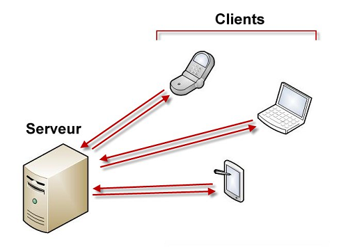
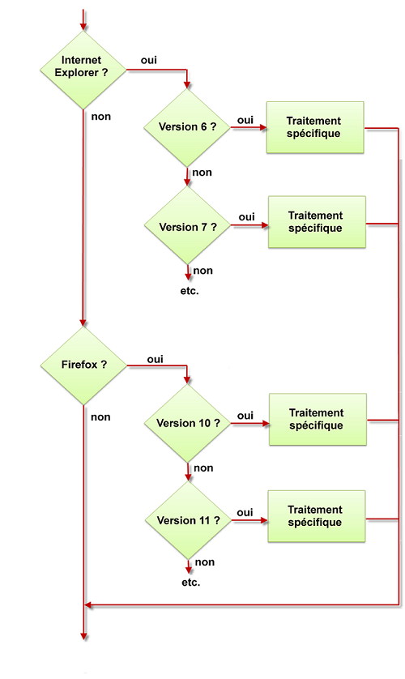
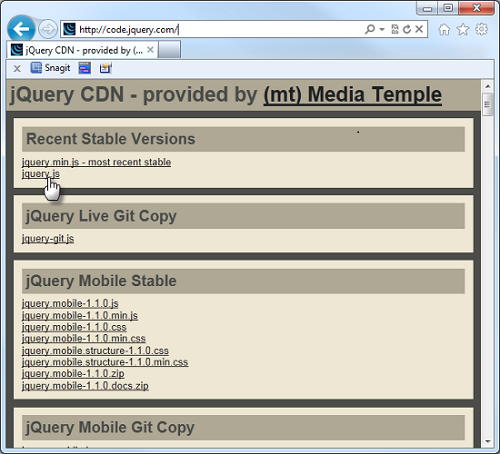
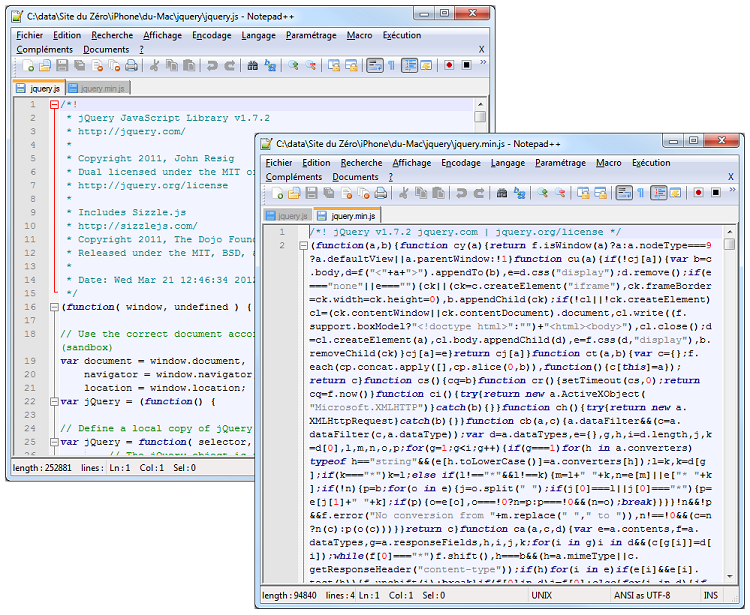
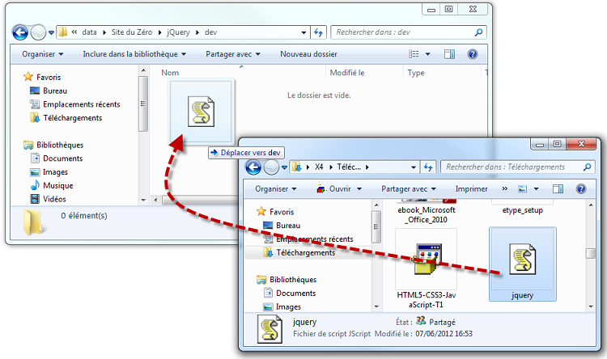
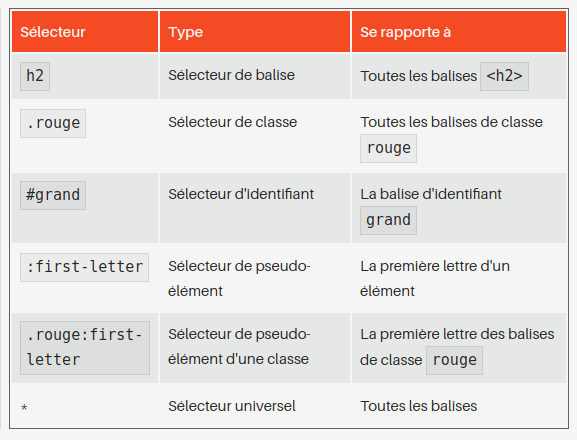

# Mémento JQuery


Pour bien comprendre le fonctionnement de JQuery, il faut comprendre la technique client-serveur utilisée pour échanger des informations sur le Web.

* Le "client" désigne tout ordinateur, tablette, téléphone  ou autre périphérique qui consomme des données.

* Le "serveur" désigne tout ordinateur qui délivre des données

Lorsque vous tapez une adresse dans votre navigateur, vous utlisez un client web. Ce client web envoie une demande d'informations au serveur correspondant. Les informations sont recherchées sur le serveur, acheminées ajusqu'au client et finalement affichées dans le navigateur du client.



Il est important de comprendre que le code JQuery s'exécute coté client. Dans la plupart des cas, il n'y aura aucun échange avec un serveur et donc quasiment aucun délai entre le débute et la fin de l'exécution du code JQuery. Attention cependant un code JQuery mal écrit ou/et non optimisé peut nécessité de nombreuses secondes (voir minutes) pour s'éxécuter!

Avec JQuery vous n'êtes soumis à la disponibilité d'aucun serveur ce qui rend les temps d'éxécution très courts.

HTML, JavaScript, AJAX et JQuery:

* **HTML** langage de base du Web, utilise un ensemble de balises pour décrire les données à afficher

* **CSS** langage consacré à la mise en forme de contenus HTML . Il assure l'uniformité des pages et facilite leur maintenance.

* **JavScript** éxécuté coté client, il ajoute de l'interactivité aux pages web

* **AJAX** permet de mettre à jour une partie (et une partie seulement) d'une page web en demandant les données nécessaires à un serveur. Les échanges client-serveur sont donc limités et les pages Web sont affichée plus rapidement.

* **JQuery** est une bibliothèque (c'est à dire un ensemble de codes prêts à l'emploi) conçue pour simplifier l'écriture de code JavaScript et AJAX.


Ce shéma suppose qu'une page Web est affichée sur l'ordinateur, la tablette ou le téléphone client. Le code JQuery peut mettrre à jour la page sans accéder au serveur. Mais il peut également mettre à jour la page en demandant l'aide du serveur. Il se comporte alors comme du code AJAX (2 et 3).


## Qu'est-ce que JQuery

JQuery est une bibliothèque qui permet d'agit sur le code HTML, CSS, JavaScript et AJAX. JQuery permet de manipuler les éléments mis en place en HTML (textes, images, liens, vidéos, etc...) et mis en forme en CSS (position, taille, couleur, transparence, etc) en utilisant des instructions simples qui donnent accès aux immenses possibilités de JavaScript et d'AJAX.

Pourquoi ne pas utliser directement la puissance de JavaScript et AJAX. Cest langages sont très puissant mais sont également très "susceptibles" dnas leur syntaxe et vraiment très verbeux. Toute erreur insignifiante dans la syntaxe provoque généralement la non-exécution de l'instruction correspondante, de plus il est nécessaire d'écrire de nombreuses lignes pour faire un simple petit traitement.Une seule instruction JQuery peut remplacer plusieurs dizaine d'instructions JavaScript!

Voici où intervient JQuery dont la devise est "Write less, do more" (Ecrire moins pour faire plus). Le fait d'écrire moins de code réduit d'autant la possibilité d'écrire des erreurs dans le code.

La syntaxe utilisée en Jquery est logique, facile à mettre en oeuvre et devient vite une seconde nature du programmeur.

N'oubliez pas de tester votre code sur les principaux navigateurs (Chrome, Safari, Firefox, Opéra) pour vérifier le bon fonctionnement des interactions que vous aurez mis en place avec JQuery.

## Ressources

Documentation officielle de JQuery (en anglais): http://learn.jquery.com/

Forum de discussion dédié à JQuery (en anglais) : https://forum.jquery.com/

Forum de discussion dédié à JQuery (en français) : http://www.jquery-fr.com/forum/


## Ce qui rend JQuery si puissant et universel

JavaSript est né en 1995 et son implémentation dans les différents navigateurs à été faite de façon plutôt anarchique, certaines fonctionnalités étant retenues, d'autres pas et cela selon les différentes navigateurs et même selon les différentes version d'un même navigateur. Un véritable casse-tête pour les programmeurs.

Jquery créer en 2006 par John Resig en définissant son propre jeu d'instructions a agit comme une surcouche aux différents versions de JavaScript, qu'elles soient existantes ouà vernir. JQuery tient compte des navigateurs présents sur le marché, de leurs multiples versions et de leur compatibilités avec les instructions des langages JavaScript et AJAX.

Cela évite qu'un traitement écrit en JavaScript pour qu'il s'exécute correctement sur les différentents versions de chaque navigateurs, demande au programmeur de mettre en place une batterie de teste et doivent exécuter un code spécifique à chaque navigateur et chaque version.



Ce shéma est une caricature de la réalité ayant pour seul but de montrer la difficulté de créer un code qui s'éxécute de façon similaire sur les différentes navigateurs du marché.

Aujourd'hui on utilise des techniques plus modernes basées sur la détection des fonctionnalités supportées par chaque navigateur. Leurs mises en place peux cependant rester laborieuses.

En JQuery ces tests sont inutiles, il suffit d'éxécuter les instructions nécessaires, sans se préocupper du navigateur utlisé, ni de la version du langage JavaScript compatible avec ce navigateur. Tous ces tests sotn réalisés de façon transparencte par JQuery, vous n'avez à vous préoccuper que du code.

JQuery est très pratique mais ne négliger pas des bases solides HTML pour ne vous concentrer que sur l'aspect visuel du développement.

Lorsque une nouvelle version de JavaScript, voit le jour, les instructions JQuery sont complétées en conséquence. Vous pouvez continuer à utiliser les instructions qvec lesquelles vous avez l'habitude de travailler et/ou consulter la documentation sur les nouvelles instructions disponibless. . Toutes les instructions JQuery utlisées fonctionnneront dans tous les navigateurs disponibles.

Autres avantages de JQuery:

* Documentation officielle très fournie et de grande qualité
* Grande communauté en perpétuelle expansion fournissant un support de qualité
* De nombreux acteurs de premier plan du Web utilisent JQuery (Microsoft, Google, Amazon, Twitter, Mozilla, ...)
* Une multitudes de plugins est disponible afin d'augmenter les possibilités de base de JQuery.

## Installer Jquery

JQuery est une bibliothèque JavaScript. En d'autres termes, un fichier d'extension ```.js```. Pour l'utiliser dans une page HTML, il suffit d'y faire référence en utilisant une balise ```<script>```

```html
<script src="jquery.js"></script>
```

Dans cet exemple, l'attribut `src` vaut `jquery.js`. L'emplacement du fichier n'est pas précisé dans l'attribut. Cela signifie qu'il devra se trouver dans le même dossier que le document HTML.

Mais ce code seul ne fonctionnera pas si le fichier jquery.js n'est pas sur votre ordinateur. Vous avez donc 2 possibilités:

* Ordinateur pas raccordé à internet ou connexion lente: télécharger la bibliothèque JQuery dans une dossier quelconque et y faire référence localement.

* Si votre ordinateur est toujours connecté à internet. vosu pouvez faire référence à la bibliothèque JQuery en indiquant une adresse Web.

Voici ces 2 solutions expliquée en détails:

### Téléchargement de JQuery sur votre Ordinateur

Aller sur le site de JQuery : https://code.jquery.com/ et télécharger la dernière version en date en cliquant sur le lien ´jquery.js´ dans le cadre ´Recent Stable Versions´.



Vous pouvez choisir entre la version jquery.js (utilisée en développement) et la version jquery.min.js (utilisée en production lorsque le code aura été testé, débogué et placé sur le web). Cest deux fichiers sont strictement identiques d'un point de vue fonctionnel. Par contre le deuxième (jquery.min.js) à une taille inférieure car tous les espaces et tabulations et commentaires ont été suppriméset le noms de variables et des fonctions ont été raccourcis.



Vous pouvez aussi minimiser vos propres script Jquery pour qu'ils se chargent plus vite avec Google Closure Compiler (https://closure-compiler.appspot.com/home) ou YUI Compressor (https://developer.yahoo.com/yui/compressor/)

Aller dans le dossier de téléchargement de votre ordinateur pour récupérer le fichier jquery.js et déplacer le dans le dossier où vous développez vos codes JQuery.



Si vous disposez d'une connexion internet rapide et permanente , vous pouvez également faire référence au ficheir jquery.js sur un CDN (pour Content DElivery Network). Constitués d'ordinateurs reliés en réseau via internet . Ces éléments d'infrastructures coopèrrent pour mettre à disposition aussi vit que possible la bibliothèque JQuery. Vous pouvez utilisez les CSN JQuery, Google ou Microsoft. Voici les adresses correspondantes

**JQuery**
version non minimisée : http://code.jquery.com/jquery.js
version minimisée: http://code.jquery.com/jquery.min.js

**Google**
version non minimisée : http://ajax.googleapis.com/ajax/libs/jquery/1/jquery.js
version minimisée: http://ajax.googleapis.com/ajax/libs/j [...] jquery.min.js

**Microsoft**
version non minimisée : http://ajax.aspnetcdn.com/ajax/jQuery/jquery-1.7.2.js
version minimisée: http://ajax.aspnetcdn.com/ajax/jQuery/jquery-1.7.2.min.js

Attention les CDN JQuery et Google donnent directement accès à la dernière version de JQuery, mais pour le CDN Microsoft il faut préciser la version à utiliser dans l'adresse. Cela peut être utile si vous voulez utlisez une version particulière de JQuery.

Voici la page listant les différentes versions de JQuery : https://docs.microsoft.com/en-us/aspnet/ajax/cdn/overview#jQuery_Releases_on_the_CDN_0

L'utilisation d'un CDN est intéressante en production (quand votre code JQuery a été testé et hébergé sur une serveur Web).car :

* En faisant référence à un fichier externe à votre site, vous n'entamez pas sa bande passante.

* Etant donnés que les CDN ont une grande bande passante, ils sont très réactifs.

* Le fichier jquery.min.js issu d'un CDN est bien souvent déja présent dans la mémoire cache du navigateur.

Ces trois raisons font que votre page se chargera plus rapidement.

Par contre en phase de développement (lorsque vous mettez votre code JQuery au point sur votre ordinateur local),il est conseillé de télécharger le fichier jquery.js et d'y faire référence localement. En effet même si les les CDN ont une excellente bande passante, l'utilisation d'un fichier local est bien plus rapide.

###  En Résumé

* En règle générale, le code JQuery s'exécute sur les ordinateurs clients. Cependant il peut parfois demander à un serveur de mettre à jour une partie d'une page en utlisant du code AJAX.

* La meilleure technique pour développer du code JQuery sur son ordinateur consiste à télécharger le fichier jquery.js, à le placer dans un dossier de son disque dur et à faire référence à ce fichier dans une balise <script> dans votre fichier html..

* Lorsque le code a été testé et débogué, vous le placerez sur un serveur Web avec votre client FTP (exemple: FileZilla) et vous ferez référence au fichier jquery.min.js stocké sur un CDN pour améliorer les temsp de réponses sans grignoter la bande passante de votre serveur.


## Premiers pas

Les pages Web qui utilisent des instructions JQuery sont construites selon un modèle bien précis. Le "squelette" présenté ici servira tout au long de ce cours.

### Le vocabulaire à connaitre

Voici une liste de termes propres aux langages HTML, CSS , JavasScript et JQuery. Vous pourrez vous y reporter si vous rencontrer un terme dont la signification vous échappe. Vous pouvez également vous référer au cours: Apprenez à créer votre site web avec HTML5 et CSS3 (https://openclassrooms.com/courses/apprenez-a-creer-votre-site-web-avec-html5-et-css3) et Dynamisez vos sites web avec Javascript (https://openclassrooms.com/courses/dynamisez-vos-sites-web-avec-javascript)!

**Balise**

Aussi appelée élément ou tag, c'est l'entité de base du langage HTML. Les balises sont toujours encadrées par les caractères < et >. Par exemple <html> ou encore <body>. Les balises ouvertes doivent être fermées avec une balise fermante. Par exemple </html> ou encore </body>. Certaines balises peuvent être à la fois ouvrantes et fermantes. Dans ce cas, le caractère / apparaît avant le signe > de fin de balise. Par exemple, .

**Attribut**

Outre leur nom, certaines balises HTML peuvent recevoir une ou plusieurs informations complémentaires. Ces informations sont des attributs. Toujours spécifiés dans la balise ouvrante, ils sont suivis d'un signe = et d'une valeur entre guillemets. Lorsqu'une balise contient plusieurs attributs, ils sont séparés par des espaces. La balise  du code  contient trois attributs : src, alt et id.

**Block**

Les balises HTML de type block sont affichées sur des lignes successives. Par exemple, si l'on définit deux balises <div> dans un document HTML, elles seront affichées l'une en dessous de l'autre. Les balises de type block peuvent être dimensionnées, et donc occuper un espace bien défini (hauteur et largeur) dans un document.

**Inline**

Les balises HTML de type inline sont affichées les unes à la suite des autres. Par exemple, si l'on définit deux balises <span> dans un document HTML, elles seront affichées sur une même ligne. Les balises de type inline ne peuvent pas être dimensionnées. Elles occupent un espace qui dépend de leur contenu.

**Inline-block**

C'est un mélange des types inline et block. Si on définit deux balises de type inline-block dans un document HTML, elles seront affichées l'une à la suite de l'autre (c'est le comportement des balises inline). Leur taille (largeur et hauteur) pourra également être définie (c'est le comportement des balises block).

**Feuille de styles**

C'est un document qui rassemble un ou plusieurs styles CSS qui définissent la mise en forme d'un document. Si la feuille de styles est interne à un document, les différents styles doivent être définis dans l'en-tête du document, entre les balises <style type="text/css"> et </style>. Si la feuille de styles est externe, vous devez définir les styles dans un fichier d'extension .css et y faire référence dans l'en-tête du document en utilisant une balise <link rel="stylesheet" type="text/css" href="feuille-de-styles.css" />. Ici, la feuille de styles a pour nom feuille-de-styles.css.

**Propriétés CSS**

Elles définissent les caractéristiques d'un style CSS. Elles sont précisées dans la feuille de styles, entre les accolades ouvrante et fermante qui suivent le nom du style. Dans l'exemple qui suit, color et margin sont des propriétés CSS :

```css
li
{
  color: red;
  margin: 10px;
}
```

**Sélecteur CSS**

Pour définir une règle CSS, on utilise un sélecteur qui indique à quoi va se reporter la règle. Il peut s'agir d'un sélecteur de balise, de classe, d'identifiant, de pseudo-élément, voire même d'un sélecteur universel qui s'adresse à toutes les balises du document. Le tableau suivant montre quelques exemples pour mieux comprendre le fonctionnement des sélecteurs.



**W3C**

Le World Wide Web Consortium (W3C), est un organisme de standardisation à but non lucratif, chargé de promouvoir la compatibilité des technologies du World Wide Web telles que HTML, XHTML, XML, RDF, CSS, PNG, SVG et SOAP.

**DOM**

Le Document Object Model est une structure de données qui représente un document HTML comme une arborescence. La racine de cet arbre est un nœud nommé document qui correspond grossièrement à la balise <html>. Tout aussi grossièrement, les balises HTML définies dans la page Web correspondent aux nœuds de l'arbre DOM et en constituent la structure. Le langage jQuery est en mesure d'interroger le DOM pour connaître les caractéristiques (attributs et valeurs HTML, propriétés et valeurs CSS) des balises qui constituent un document HTML, mais aussi de modifier ces éléments pour changer l'allure et/ou le contenu du document.

**DTD**

Le Document TYPE Declaration fait référence à la balise <!DOCTYPE>. Cette dernière doit apparaître en tête des documents HTML. Elle indique au navigateur les règles d'écriture utilisées dans le document. Dans ce cours, nous utiliserons systématiquement les règles d'écriture du langage HTML5. Le DTD correspondant sera <!DOCTYPE html>.

**Jeu de caractères**

Le jeu de caractères d'un document HTML est associé aux différents claviers nationaux. Pour indiquer au navigateur dans quel jeu de caractères vous travaillez, vous devez insérer une balise <meta charset=""> dans l'en-tête du document. Deux jeux de caractères sont essentiellement utilisés :

* ISO-8859-1 pour accéder à la majorité des caractères des langues occidentales, telles que le français, l'anglais, l'allemand, l'espagnol, etc.

* UTF-8 pour afficher sur une même page des caractères issus de plusieurs langues (français et japonais par exemple).

Selon vos besoins, vous utiliserez donc une balise <meta charset="ISO-8859-1"> ou <meta charset="UTF-8">.

**Fonction jQuery**

C'est le point d'entrée de la bibliothèque jQuery. Vous pouvez utiliser au choix l'instruction jQuery() ou son alias $(). Dans ce cours, nous utiliserons systématiquement l'alias pour limiter l'écriture.

**Méthodes jQuery**

La bibliothèque jQuery est constituée d'un ensemble de blocs de code autonomes appelés méthodes. Ce qui fait la puissance de cette bibliothèque, c'est avant tout la grande diversité des méthodes proposées. Pour exécuter une méthode jQuery, il suffit de préciser son nom à la suite d'un sélecteur en le séparant de ce dernier par un point : $(sélecteur).méthode(paramètres);.

**Objet jQuery**

On appelle « objet jQuery » l'entité retournée par la fonction jQuery, c'est-à-dire par $(). Cet objet représente un ensemble de zéro, un ou plusieurs éléments issus du document.

## Le squelette HTML typique

Voici le squelette typique d'un document HTML dans lequel on utilise du code JQuery. Il y a en fait non pas 1 squelette mais 2 (1 pour le développement et 1 pour la production). Seule une balise diffère entre ces deux versions mais elle fait toute la différence !

```HTML
<!DOCTYPE html>
<html>
  <head>
    <meta charset="UTF-8">
    <title>Le titre du document</title>
    <link rel="stylesheet" type="text/css" href="feuille-de-styles.css">
  </head>
  <body>
    <!-- Une ou plusieurs balises HTML pour définir le contenu du document -->
    <script src="jquery.js"></script>
    <script src="mon-script.js"></script>
  </body>
</html>
```
La première ligne de script placé dans le body fait référence à la bibliothèque jquery.js. Celle-ci doit se trouver dans le même dossier que le fichier html si aucun autre chemin n'est indiqué dans src à par le nom du fichier de la bibliothèque jquery.js. Pour télécharger la version non minimisée et minimisé de jquery rendez-vous ici: https://jquery.com/download/ . Cliquez sur le lien qui vous intéresse puis dans la page de code qui s'affichefaite un clic droit et choisissez "Save to" et enregistrer le fichier dans le dossier de votre projet soit à la racine, soit dand un sous-dossier js dans ce cas n'oubliez pas de modifier le chemin d'accès au fichier dans la balise script de votre page html (exemple : <script src="js/jquery-3.3.1.js"></script>).

La seconde ligne de script fait référence à un fichier JavaScript externe à votre page dans lequel vous placerez tout le code JQuery en rapport avec le document.

Au final, on se retrouve donc avec quatre fichiers:

* un document html reprenant le contenu de la page
* une feuille de style .css qui définit la mise en forme du document
* un fichier jquery.js qui contient la bibliothèque jQuery
* Un fichier JavaScript externe qui contient tout le code JQuery que vous développerez

Il est fortement recommandé d'externaliser les codes CSS et JQuery même si cela fonctionne en placant le code CSS et JQuery dans le document HTML. Car en externalisant le css et le jquery, on pourra facilement les réutilisez et on obtiendra aussi un code plus propre et plus facilement maintenable. On réduit le temps de développement, on minimise le risque d'erreurs puisque le mêm code sera utilisé dans les différent document HTML, la maintenance est facilité, pour effectuer une modification dans tout le site, il suffit d'agit sur la feuille de style externe et sur le fichier code javascript externe, si le code se trouve dans les fichiers HTML de chaque page, il faudra modifié ce code sur chacune des pages.

### Squelette HTML en phase de production

Lorsque votre code HTML/CSS/JQuery/JavaScript fonctionne à la perfection, avant d'utiliser un client FTP (type FileZilla), assurez-vous que vous faites référence à la version minimisée de la bibliothèque JQuery et que vous la chargez sur un CDN.

Voici par exemple le code à utiliser avec la version minimisé du code du CDN de Google:

```HTML
<!DOCTYPE html>
<html>
  <head>
    <meta charset="UTF-8">
    <title>Le titre du document</title>
    <link rel="stylesheet" type="text/css" href="feuille-de-styles.css">
  </head>
  <body>
    <!-- Une ou plusieurs balises HTML pour définir le contenu du document -->
    <script src="http://ajax.googleapis.com/ajax/libs/jquery/1/jquery.min.js"></script>
    <script src="mon-script.js"></script>
  </body>
</html>
```

### Optimisation du code

Voici quelques recommandations qui augmenteront les performances des pages qui contiennent du code JQuery:

1. Invoquez la bibliothèque jquery.js à la fin du document (juste avant la balise </body)
2. Insérez le code JQuery rattaché à la page dans un fichier annexe et faites référence à ce fichier justea près la balise qui indique où se trouve la bibliothèque JQuery.

Ces positions stratégiques optimisent le temps de chargement de la page. De nombreux navigateurs bloquent l'exécution du code qui suit une balise <script> jusqu'à ce que cette balise ait été chargée et exécutée. En plaçant les deux balises <scriptW juste avant la balise </body>, l'affichage de la page n'est pas "freinée" par le code JQuery.


## Attendre la disponibilité du Document
