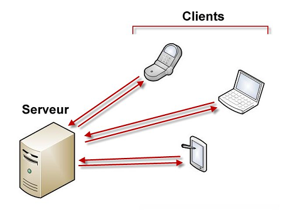

# Mémento JQuery

Pour bien comprendre le fonctionnement de JQuery, il faut comprendre la technique client-serveur utilisée pour échanger des informations sur le Web.

* Le "client" désigne tout ordinateur, tablette, téléphone  ou autre périphérique qui consomme des données.

* Le "serveur" désigne tout ordinateur qui délivre des données

Lorsque vous tapez une adresse dans votre navigateur, vous utlisez un client web. Ce client web envoie une demande d'informations au serveur correspondant. Les informations sont recherchées sur le serveur, acheminées ajusqu'au client et finalement affichées dans le navigateur du client.

Il est important de comprendre que le code JQuery s'exécute coté client. Dans la plupart des cas, il n'y aura aucun échange avec un serveur et donc quasiment aucun délai entre le débute et la fin de l'exécution du code JQuery. Attention cependant un code JQuery mal écrit ou/et non optimisé peut nécessité de nombreuses secondes (voir minutes) pour s'éxécuter!

Avec JQuery vous n'êtes soumis à la disponibilité d'aucun serveur ce qui rend les temps d'éxécution très courts.

HTML, JavaScript, AJAX et JQuery:

* **HTML** langage de base du Web, utilise un ensemble de balises pour décrire les données à afficher

* **CSS** langage consacré à la mise en forme de contenus HTML . Il assure l'uniformité des pages et facilite leur maintenance.

* **JavScript** éxécuté coté client, il ajoute de l'__interactivité__ aux pages web

* **AJAX** permet de mettre à jour une partie (et une partie seulement) d'une page web en demandant les données nécessaires à un serveur. Les échanges client-serveur sont donc limités et les pages Web sont affichée plus rapidement.

* **JQuery** est une bibliothèque (c'est à dire un ensemble de codes prêts à l'emploi) conçue pour simplifier l'écriture de code JavaScript et AJAX.

