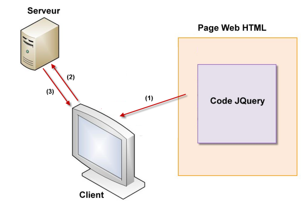
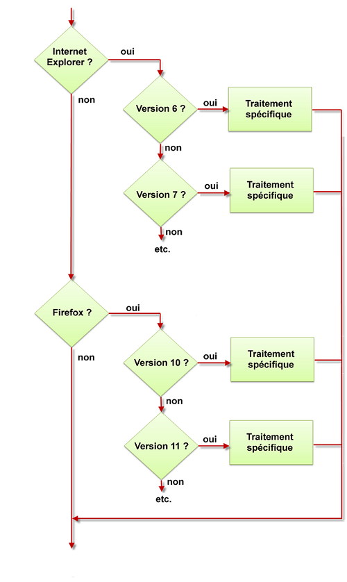

# Mémento JQuery

Pour bien comprendre le fonctionnement de JQuery, il faut comprendre la technique client-serveur utilisée pour échanger des informations sur le Web.

* Le "client" désigne tout ordinateur, tablette, téléphone  ou autre périphérique qui consomme des données.

* Le "serveur" désigne tout ordinateur qui délivre des données

Lorsque vous tapez une adresse dans votre navigateur, vous utlisez un client web. Ce client web envoie une demande d'informations au serveur correspondant. Les informations sont recherchées sur le serveur, acheminées ajusqu'au client et finalement affichées dans le navigateur du client.

Il est important de comprendre que le code JQuery s'exécute coté client. Dans la plupart des cas, il n'y aura aucun échange avec un serveur et donc quasiment aucun délai entre le débute et la fin de l'exécution du code JQuery. Attention cependant un code JQuery mal écrit ou/et non optimisé peut nécessité de nombreuses secondes (voir minutes) pour s'éxécuter!

Avec JQuery vous n'êtes soumis à la disponibilité d'aucun serveur ce qui rend les temps d'éxécution très courts.

HTML, JavaScript, AJAX et JQuery:

* **HTML** langage de base du Web, utilise un ensemble de balises pour décrire les données à afficher

* **CSS** langage consacré à la mise en forme de contenus HTML . Il assure l'uniformité des pages et facilite leur maintenance.

* **JavScript** éxécuté coté client, il ajoute de l'interactivité aux pages web

* **AJAX** permet de mettre à jour une partie (et une partie seulement) d'une page web en demandant les données nécessaires à un serveur. Les échanges client-serveur sont donc limités et les pages Web sont affichée plus rapidement.

* **JQuery** est une bibliothèque (c'est à dire un ensemble de codes prêts à l'emploi) conçue pour simplifier l'écriture de code JavaScript et AJAX.

Ce shéma suppose qu'une page Web est affichée sur l'ordinateur, la tablette ou le téléphone client. Le code JQuery peut mettrre à jour la page sans accéder au serveur. Mais il peut également mettre à jour la page en demandant l'aide du serveur. Il se comporte alors comme du code AJAX (2 et 3).

## Qu'est-ce que JQuery

JQuery est une bibliothèque qui permet d'agit sur le code HTML, CSS, JavaScript et AJAX. JQuery permet de manipuler les éléments mis en place en HTML (textes, images, liens, vidéos, etc...) et mis en forme en CSS (position, taille, couleur, transparence, etc) en utilisant des instructions simples qui donnent accès aux immenses possibilités de JavaScript et d'AJAX.

Pourquoi ne pas utliser directement la puissance de JavaScript et AJAX. Cest langages sont très puissant mais sont également très "susceptibles" dnas leur syntaxe et vraiment très verbeux. Toute erreur insignifiante dans la syntaxe provoque généralement la non-exécution de l'instruction correspondante, de plus il est nécessaire d'écrire de nombreuses lignes pour faire un simple petit traitement.Une seule instruction JQuery peut remplacer plusieurs dizaine d'instructions JavaScript!

Voici où intervient JQuery dont la devise est "Write less, do more" (Ecrire moins pour faire plus). Le fait d'écrire moins de code réduit d'autant la possibilité d'écrire des erreurs dans le code.

La syntaxe utilisée en Jquery est logique, facile à mettre en oeuvre et devient vite une seconde nature du programmeur.

N'oubliez pas de tester votre code sur les principaux navigateurs (Chrome, Safari, Firefox, Opéra) pour vérifier le bon fonctionnement des interactions que vous aurez mis en place avec JQuery.

## Ressources

Documentation officielle de JQuery (en anglais): http://learn.jquery.com/

Forum de discussion dédié à JQuery (en anglais) : https://forum.jquery.com/

Forum de discussion dédié à JQuery (en français) : http://www.jquery-fr.com/forum/

## Ce qui rend JQuery si puissant et universel

JavaSript est né en 1995 et son implémentation dans les différents navigateurs à été faite de façon plutôt anarchique, certaines fonctionnalités étant retenues, d'autres pas et cela selon les différentes navigateurs et même selon les différentes version d'un même navigateur. Un véritable casse-tête pour les programmeurs.

Jquery créer en 2006 par John Resig en définissant son propre jeu d'instructions a agit comme une surcouche aux différents versions de JavaScript, qu'elles soient existantes ouà vernir. JQuery tient compte des navigateurs présents sur le marché, de leurs multiples versions et de leur compatibilités avec les instructions des langages JavaScript et AJAX.

Cela évite qu'un traitement écrit en JavaScript pour qu'il s'exécute correctement sur les différentents versions de chaque navigateurs, demande au programmeur de mettre en place une batterie de teste et doivent exécuter un code spécifique à chaque navigateur et chaque version.

Ce shéma est une caricature de la réalité ayant pour seul but de montrer la difficulté de créer un code qui s'éxécute de façon similaire sur les différentes navigateurs du marché.

Aujourd'hui on utilise des techniques plus modernes basées sur la détection des fonctionnalités supportées par chaque navigateur. Leurs mises en place peux cependant rester laborieuses.

En JQuery ces tests sont inutiles, il suffit d'éxécuter les instructions nécessaires, sans se préocupper du navigateur utlisé, ni de la version du langage JavaScript compatible avec ce navigateur. Tous ces tests sotn réalisés de façon transparencte par JQuery, vous n'avez à vous préoccuper que du code.

JQuery est très pratique mais ne négliger pas des bases solides HTML pour ne vous concentrer que sur l'aspect visuel du développement.

Lorsque une nouvelle version de JavaScript, voit le jour, les instructions JQuery sont complétées en conséquence. Vous pouvez continuer à utiliser les instructions qvec lesquelles vous avez l'habitude de travailler et/ou consulter la documentation sur les nouvelles instructions disponibless. . Toutes les instructions JQuery utlisées fonctionnneront dans tous les navigateurs disponibles.

Autres avantages de JQuery:

* Documentation officielle très fournie et de grande qualité
* Grande communauté en perpétuelle expansion fournissant un support de qualité
* De nombreux acteurs de premier plan du Web utilisent JQuery (Microsoft, Google, Amazon, Twitter, Mozilla, ...)
* Une multitudes de plugins est disponible afin d'augmenter les possibilités de base de JQuery.

## Installer Jquery
